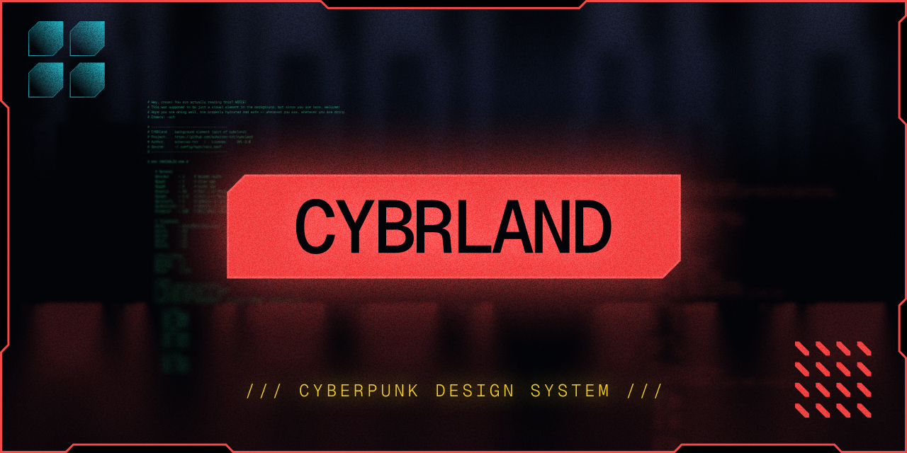
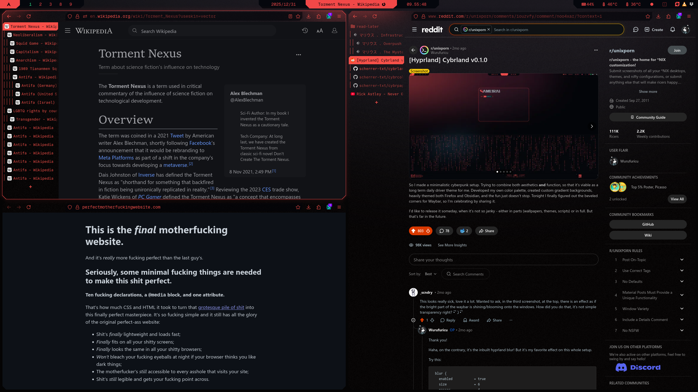
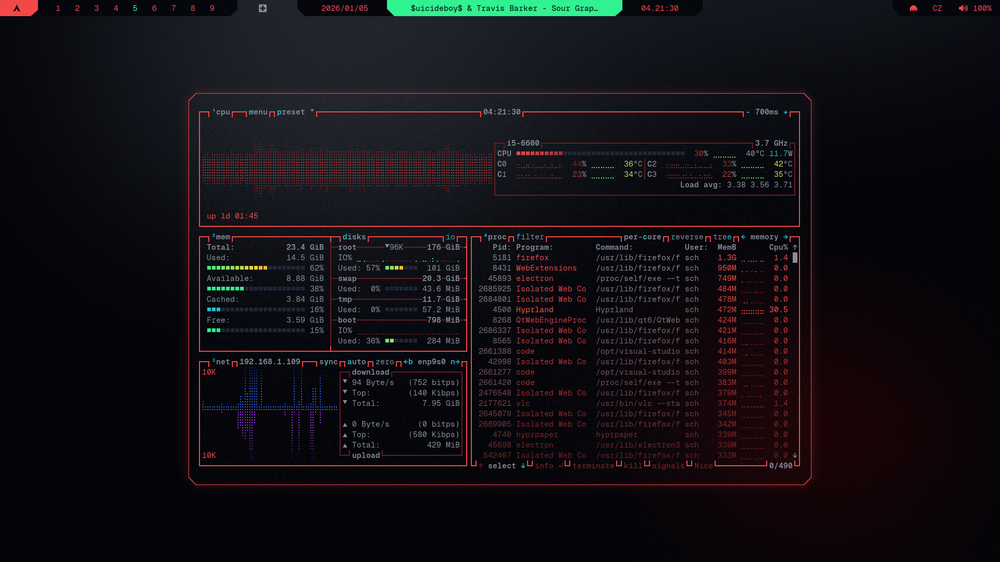

# Cybrland
**A complete design system and dotfile setup for Arch Hyprland, inspired by cyberpunk aesthetics.**

**Version:** v0.9.0  |  **Status:** WIP (Dec 2025)  

## Features
- 🔴 Unified cyberpunk color palette across all applications
- 🟣 Terminal-first workflow with TUI/CLI tools
- 🟡 Custom themes for 15+ programs
- 🔵 Modular configs - use what you need
- 🟢 Beginner-friendly documentation

---

## Showcase

  

  <em>Waybar, Hyprland, Kitty, Starship ↗</em>

 

  

  <em>rofi ↗ (launcher, clipboard, emoji, powermenu, screenshot menu, wallpaper menu)</em>

 

  

  <em>Hyprlock ↗</em>

 SHOW MORE 

  

  <em>Firefox ↗</em>

 

  

  <em>btop ↗</em>

 

  

  <em>swaync ↗ (floating notifications; control center; control center list)</em>

 

## Included Themes

### ✅ Core System (Stable)
Complete themes with full documentation:

- **[hyprland](./hypr/readme.md)** - Tiling window manager
- **[kitty](./kitty/readme.md)** - Terminal emulator
- **[fish](./fish/readme.md)** - User-friendly shell
- **[waybar](./waybar/readme.md)** - Status bar with custom modules
- **[rofi](./rofi/readme.md)** - Application launcher & menus
- **[swaync](./swaync/readme.md)** - Notification daemon
- **[starship](./starship/readme.md)** - Cross-shell prompt

### 🛠️ Utilities (Stable)
- **[btop](./btop/readme.md)** - System resource monitor
- **[nvtop](./nvtop/readme.md)** - GPU resource monitor
- **[yazi](./yazi/readme.md)** - Terminal file manager
- **[broot](./broot/readme.md)** - Directory navigator
- **[fzf](./fzf/readme.md)** - Fuzzy finder
- **[micro](./micro/readme.md)** - Lightweight text editor
- **[cava](./cava/readme.md)** - Audio visualizer

### 🧪 Beta / Alpha
- **[neovim](./neovim/readme.md)** 🟡 Beta - Fully themed; polishing
- **[firefox](./firefox/readme.md)** 🔴 Alpha - Themed; major refactor planned
- **Cybrcursors** - 🔴 Alpha - Fully themed; polishing
- **VSCode** 🔴 Alpha - Early stage
- **Obsidian** 🔴 Alpha - Plugin-based, standalone theme planned

### 📋 Planned (v1.5+)
- **Spicetify** - Spotify client theme
- **Vencord** - Discord client theme
- **rmpc** - Music player theme
- **Theme switcher** - Color theme switcher

## Related projects
- [Cybrpapers](https://github.com/scherrer-txt/cybrpapers) - Hand-crafted cyberpunk wallpapers
- [Cybrcolors](https://github.com/scherrer-txt/cybrcolors) - Unified color palette
- Cybrcursors - custom mouse cursors ([preview](https://8upload.com/image/d91ecbad191c4ec9/image_3.jpg))

## Roadmap

### v1.0.0 (2025-12-31)
- [x] Technical documentation  
- [x] Themes
  - [x] hyprland  
  - [x] kitty  
  - [x] fish  
  - [x] waybar  
  - [x] rofi  
  - [x] swaync  
  - [x] starship  
  - [x] btop  
  - [x] nvtop
  - [x] yazi  
  - [x] broot  
  - [x] fzf  
  - [x] micro
  - [x] cava  
  - [x] neovim (*beta*)
  - [x] firefox (*alpha*)

### v1.5.0 (Early 2026)
- [ ] Installer script
- [ ] Extended multi-distro support documentation
- [ ] Finish alpha themes (Firefox, VSCode, Obsidian)
- [ ] Cybrcursors release
- [ ] Music player theme (rmpc/Spicetify)
- [ ] Chat app theme (Vencord)
- [ ] Theme switcher
- [ ] Additional Cybrpaper wallpapers

**Under consideration:**
- Replace waybar/swaync/rofi with quickshell
- Alternative launcher (Vicinae or Walker)

### v2.0.0 (mid 2026)
- [ ] GTK theme  
