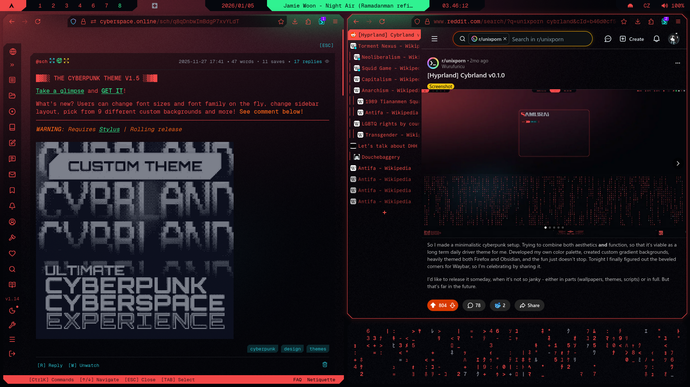
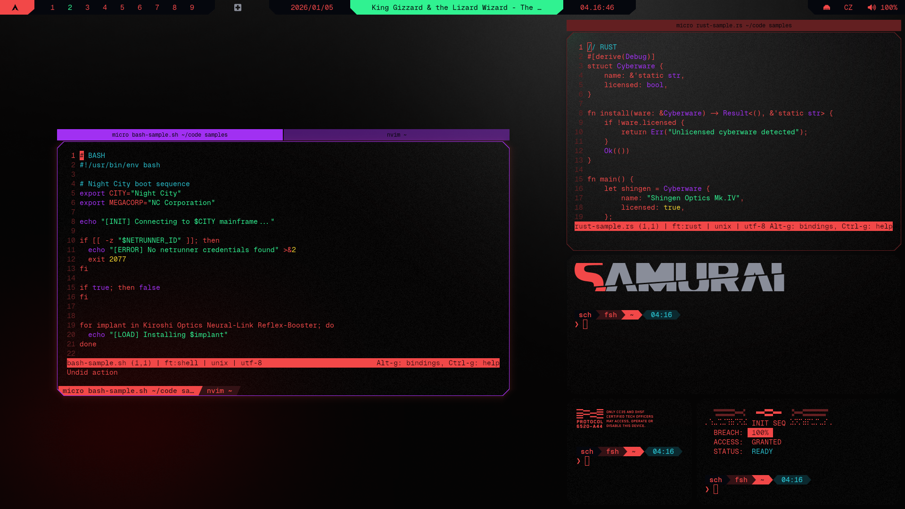

```
░▒▓█▓▒░░▒▓█▓▒░▒▓█▓▒░░▒▓█▓▒░▒▓███████▓▒░░▒▓███████▓▒░  
░▒▓█▓▒░░▒▓█▓▒░▒▓█▓▒░░▒▓█▓▒░▒▓█▓▒░░▒▓█▓▒░▒▓█▓▒░░▒▓█▓▒░ 
░▒▓█▓▒░░▒▓█▓▒░▒▓█▓▒░░▒▓█▓▒░▒▓█▓▒░░▒▓█▓▒░▒▓█▓▒░░▒▓█▓▒░ 
░▒▓████████▓▒░░▒▓██████▓▒░░▒▓███████▓▒░░▒▓███████▓▒░  
░▒▓█▓▒░░▒▓█▓▒░  ░▒▓█▓▒░   ░▒▓█▓▒░      ░▒▓█▓▒░░▒▓█▓▒░ 
░▒▓█▓▒░░▒▓█▓▒░  ░▒▓█▓▒░   ░▒▓█▓▒░      ░▒▓█▓▒░░▒▓█▓▒░ 
░▒▓█▓▒░░▒▓█▓▒░  ░▒▓█▓▒░   ░▒▓█▓▒░      ░▒▓█▓▒░░▒▓█▓▒░ 
```

# Result
</td>

# Steps
### 1. Install Geist Mono Nerd Font
```sh
curl -L https://github.com/ryanoasis/nerd-fonts/releases/latest/download/GeistMono.zip -o GeistMono.zip
mkdir -p ~/.local/share/fonts
unzip GeistMono.zip -d ~/.local/share/fonts/GeistMono
fc-cache -fv
```
### 2. Install hyprland
```sh
sudo pacman -S hyprland
```
### 3. Download hyprland configs
```sh
#download hyprland directory
git clone --filter=blob:none --no-checkout https://github.com/scherrer-txt/cybrland.git
cd cybrland
git sparse-checkout init --cone
git sparse-checkout set hypr
git checkout main

# move hyprland directory to config directory
mv -i ~/cybrland/hypr ~/.config

# delete cybrland directory
cd ~ && rm -rf cybrland
```

### 5. Verify installation
```sh
ls -R ~/.config/hypr
```

You should see: `hyprland.conf`, `theme/`, `theme/theme.conf`, `theme/vars.conf`

<details>
<summary>Expected file structure</summary>

```
~/.config/hypr/
├── hyprland.conf           # main settings
├── theme/
│   ├── theme.conf          # theme settings
│   ├── vars.conf           # variables used in theme
│   ├── cava.sh             # audio visualizer
│   └── mediaplayer.py      # media player info
└── svg/                    # graphical elements
    ├── gr0-left.svg
    ├── gr0-right.svg
    └── ...
```

### 3. File structure should look like this
```code

  
  theme/
    theme.conf
    vars.conf
```


### You'll need to change your settings
#### hyprland.conf:
##### Monitors
This command:
```sh
hyprctl monitors
```
Outputs your monitors, which you can use here:
```conf
# === MONITORS === #
	
	$main=DP-2
	$secondary=HDMI-A-1

    # Main Monitor
    monitor=$main,2560x1440@144Hz,1920x0,1

    # Second Monitor
    monitor=$secondary,1920x1080@60,0x0,1

# === WORKSPACES === #

    # Left Monitor
    workspace = 1, monitor:$secondary, default:true
    ...

    # Right Monitor
    workspace = 10, monitor:$main, default:true
    ...

    # Third Monitor
    #workspace = 19, monitor:$tertiary
	...
```
##### Input
If you want to switch keyboard layouts:
```conf
# === INPUT === #

    input {
        kb_layout = us,cz
        kb_options = compose:rctrl, level3:ralt_switch, grp:alt_space_toggle

		follow_mouse = 1
        numlock_by_default = true

		touchpad {
        	natural_scroll = yes
        	disable_while_typing = true
        	scroll_factor = 1
    	}
    }
```
##### Keybinds
Feel free to change anything inside:
```conf
# === BINDS === #

    # Variables
	# Applications
	# Notifications Menu
	# Bar
	# Pickers/Launchers
	# = Screenshots
	# = Other Modules
	# Windows
	# = Basic Operations
	# = Mouse
	# = Focusing
	# = Vim-keybinds
	# = Moving
	# = Vim-keybinds
	# = Center and Split
	# = Group Control
	# = Resizing Windows
	# Workspaces
	# = Focusing other Workspaces
	# = Moving Windows to other Workspaces
	# = Moving Windows to other Workspaces (Silent)
	# = Moving to other Workspace with Mouse Control
	# = Moving to other Workspace with Keyboard
	# Monitors
	# = Moving to Next and Prev Monitors
	# Media
	# = Audio
	# = Brightness
	# Other
```


## Result
</td>

## What to do
### 1. Install `GeistMono Nerd Font` ([from here](https://www.nerdfonts.com/font-downloads))

### 2. Download `hyprland.conf`, `theme.conf` and `vars.conf`
  - `hyprland.conf` contains all **functional** setting, and is linked to`theme.conf`
  - `theme.conf` contains all **decorations**, and is linked to `vars.conf`
  - `vars.conf` contains all **variables** (*colors, gaps, font, blur etc.*)


### 4. Create a backup of your old config and theme

## Random wallpaper
> This script cycles wallpapers in a pseudo-random pattern (never shows the same wallpaper twice in a row, hence pseudo-random).

### 1. Copy [random-wallpaper](../hyprland/scripts/random-wallpaper) script inside your `hypr/scripts` folder

### 2. Make it executable
```sh
chmod +x ~/.config/hypr/scripts/random-wallpaper
```

### 3. Create a daemon service

```sh
micro ~/.config/systemd/user/wallpaper-daemon.service
```

### 4. Paste inside

```toml
[Unit]
Description=Wallpaper rotation daemon for hyprpaper

[Service]
Type=simple
ExecStart=%h/.config/hypr/scripts/wallpaper-daemon
Restart=always
RestartSec=1
KillMode=control-group

[Install]
WantedBy=default.target

```

### 5. Run

```sh
systemctl --user daemon-reload
systemctl --user enable --now wallpaper-daemon.service
```

After any future changes to the script:

```sh
systemctl --user daemon-reload
```